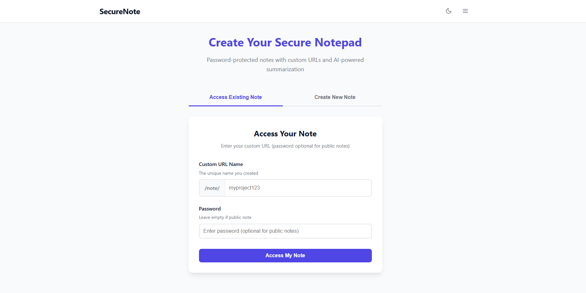
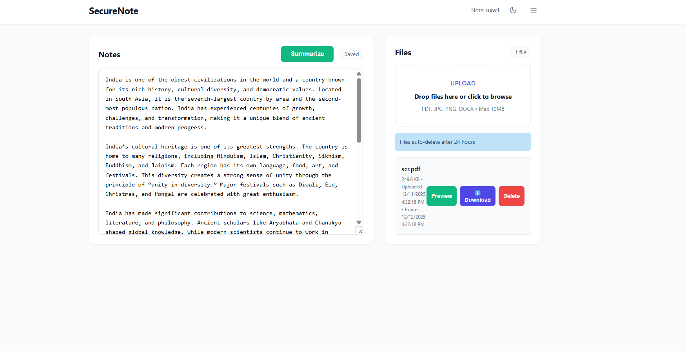
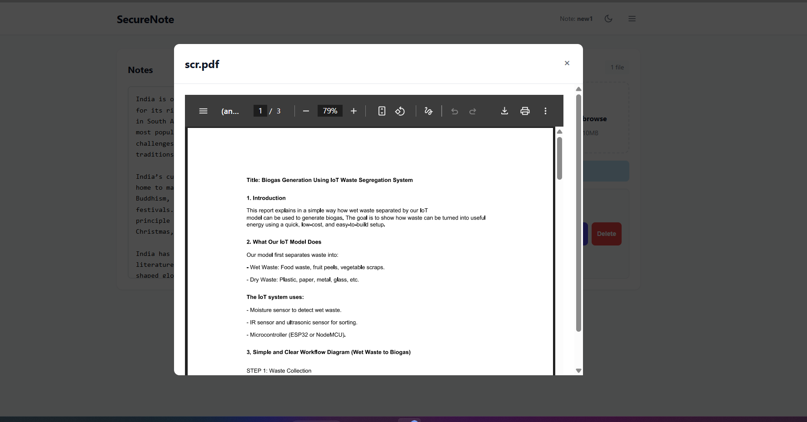
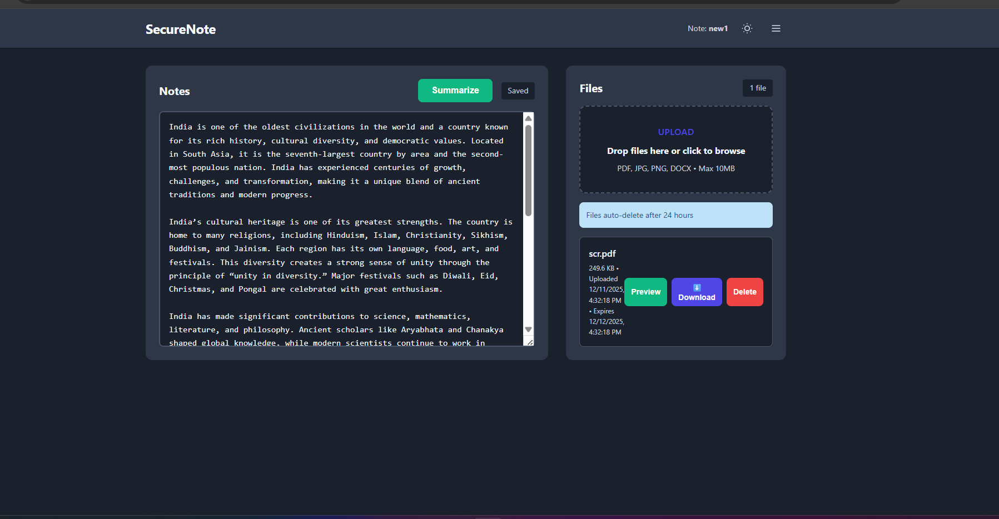
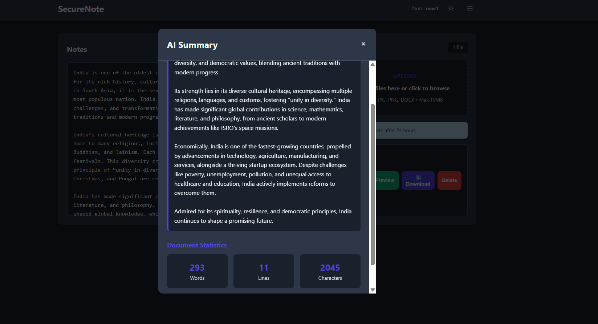

# SecureNote

Secure, shareable notes with optional passwords, AI summaries, Cloudinary uploads, and automatic 24-hour cleanup.

**Live Demo:** https://secure-pad-pro-15.onrender.com

## Highlights

- Custom URLs with public or bcrypt-protected private notes
- Auto-save every 2 seconds and auto-delete 24 hours after last edit
- Google Gemini summaries with document insights
- Cloudinary uploads (PDF, JPG, PNG, DOCX up to 10 MB)
- Responsive UI, dark mode, and security logging backed by PostgreSQL

## Quick Start

```bash
npm install
cp .env.example .env   # fill PORT, DATABASE_URL, GEMINI_API_KEY, CLOUDINARY_*
npm start               # or npm run dev
```

## Tech Stack

- Node.js · Express · PostgreSQL · Cloudinary · bcrypt
- Frontend: HTML5, CSS3, vanilla JavaScript
- AI: Google Gemini 2.5 Flash (@google/generative-ai)

## Architecture

- Browser: index.html (create/access), pad.html (editor)
- API: server.js for auth, content, uploads, AI, cleanup jobs
- Data: PostgreSQL tables (pads, files, security_logs) + Cloudinary CDN

## Screenshots







## Documentation

- docs/SETUP.md – local setup & environment
- docs/API.md – endpoint reference
- docs/SECURITY.md – authentication & hardening
- docs/DB_SCHEMA.md – PostgreSQL schema
- docs/DEPLOY.md – Render/Railway guides
- docs/TROUBLESHOOTING.md – common fixes

## Maintainer

T S Sathvik Hegade · sathvikhegade3@gmail.com · MIT License
